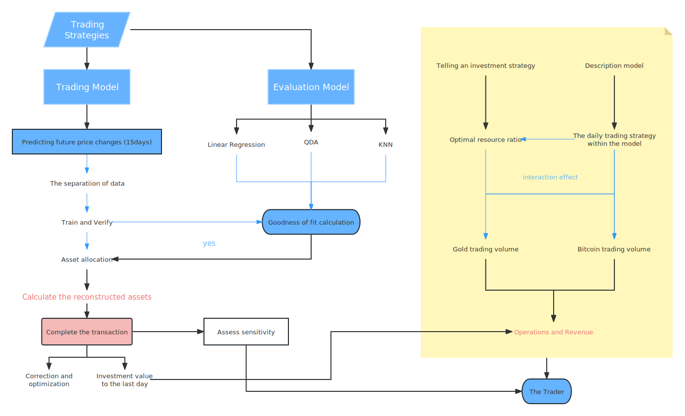

## Project Title
2022 Mathematical Contest in Modeling - Trading Strategies (Problem C)

[中文版](README.md)|[English Version](README.en.md)

## Project Description
This project is our team's entry in the 2022 Mathematical Contest in Modeling. Problem C requires us to use historical data of gold and bitcoin prices to determine daily how a trader should adjust their portfolio: buy, hold or sell. Our model, using machine learning methods (including linear regression and KNN algorithm), based on the price fluctuation before the current day and the difference between the maximum and minimum as variables, successfully predicted the price changes for the next 15 days. We use this as a reference to decide on trading strategies through specific formulas and condition judgments.

Linear Regression and KNN (K-Nearest Neighbors) are common machine learning algorithms. Linear regression is a supervised learning algorithm that is used for predicting a numeric response. KNN, on the other hand, is a classification algorithm that can be used for classification or regression.

We use the following formulas to decide on the adjustments to the investment portfolio:
```
present_crash:present_gold:present_bitcoin = logistic(δ_1+δ_2):logistic(δ_1):logistic(δ_2)

present_crash + present_gold * thePriceOfGold + present_bitcoin * thePriceOfBitcoin = previous_crash + previous_gold * thePriceOfGold + previous_bitcoin * thePriceOfBitcoin - 0.01 *  (previous_gold - present_gold)/thePriceOfGold  - 0.02 *  (previous_bitcoin - present_bitcoin)/thePriceOfBitcoin
```
In these formulas, `δ` represents the difference between the estimated average price and the current price, `1` refers to gold price, and `2` refers to bitcoin price. We conduct trading if the following condition is met:
```
crash_all < present_gold + average_gold * thePriceOfGold + average_bit * thePriceOfBitcoin
```

## Usage
In the `code` directory, you will find all of our code files:
- `data.ipynb`: Use our model to predict the value of the currency for the next 15 days.
- `model.py`: Contains the main implementation code of the model. In this Python script, we first load the data, then perform preprocessing, and finally use machine learning algorithms to train the model and make predictions.
- `plot.ipynb`: Code for making predictions using traditional methods. This Notebook file details how we use traditional financial analysis methods to make predictions.

The `paper` directory contains our papers in both Chinese and English. These papers provide detailed explanations of our model's design, implementation, and evaluation process.

The `flow_chart` directory contains flowcharts describing the main process of the project.


