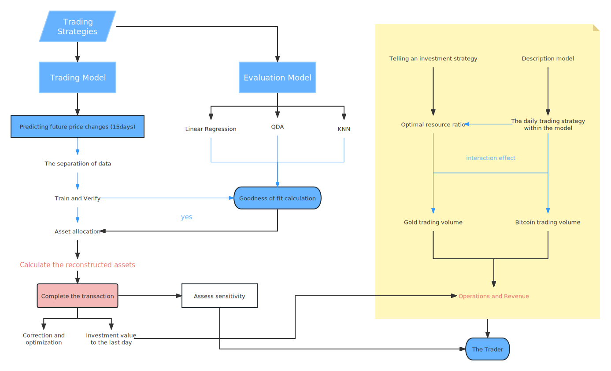

## 项目名称
2022年美国大学生数学建模大赛 - 交易策略（题目C）

[English Version](README.en.md)|[中文版](README.md)

## 项目简介
本项目是我们团队参加2022年美国大学生数学建模大赛的作品。赛题C要求我们使用金价和比特币价格的历史数据，通过建立模型，每天决定交易者应当如何调整投资组合：买入、持有还是卖出。我们的模型通过使用机器学习方法（包括线性回归和KNN算法），基于当天之前的价格波动及其极值差作为变量，成功预测出未来15天的价格变化。我们以此作为参考，通过具体公式和条件判断来决定交易策略。

线性回归和KNN（K-最近邻）都是常用的机器学习算法。线性回归是一种用于预测数值型响应的监督学习算法。KNN则是一种分类算法，可用于分类或回归。

我们使用以下公式来决定投资组合的变动：
```
present_crash:present_gold:present_bitcoin = logistic(δ_1+δ_2):logistic(δ_1):logistic(δ_2)

present_crash + present_gold * thePriceOfGold + present_bitcoin * thePriceOfBitcoin = previous_crash + previous_gold * thePriceOfGold + previous_bitcoin * thePriceOfBitcoin - 0.01 *  (previous_gold - present_gold)/thePriceOfGold  - 0.02 *  (previous_bitcoin - present_bitcoin)/thePriceOfBitcoin
```
在此公式中，`δ`代表预估平均价格与现价之间的差值，`1`表示金价，`2`表示比特币价格。如果满足以下条件，我们就进行交易：
```
crash_all < present_gold + average_gold * thePriceOfGold + average_bit * thePriceOfBitcoin
```

## 使用方法
在`code`目录下，可以找到我们所有的代码文件：
- `data.ipynb`：使用我们的模型进行未来15天货币价值的预测。
- `model.py`：包含模型的主要实现代码。在这个Python脚本中，我们首先加载数据，然后进行预处理，最后使用机器学习算法来训练模型并进行预测。
- `plot.ipynb`：采用传统方法进行预测的代码。这个Notebook文件详细说明了我们如何使用传统的金融分析方法来进行预测。

`paper`目录下，包含我们的中英两版的论文。这些论文详细阐述了我们的模型设计、实现和评估过程。

`flow_chart`目录中存放的是描述项目主要流程的流程图。


